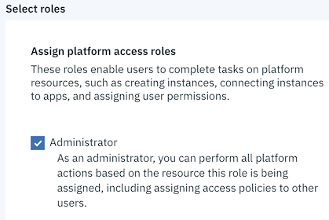

---

copyright:
  years: 2018
lastupdated: "2018-12-13"

---

<!-- Common attributes used in the template are defined as follows: -->
{:shortdesc: .shortdesc}
{:tip: .tip}
{:new_window: target="_blank"}

# Troubleshooting for ordering services

## Insufficient permission to submit an order
{: #permission}
Follow these steps if you do not have the required permissions to submit an order in the **Consult with IBM Cloud Garage** service.

### What's happening
When you select *Submit Order* in the details page, you receive an error message that states you do not have the required permission to create an instance.

### Why it's happening
Your {{site.data.keyword.cloud}} user account must have the IAM Editor or higher access level to submit an order with the "Consult with IBM Cloud Garage" service.

### How to fix it
To solve this issue, have your {{site.data.keyword.cloud}} account administrator set your user account to the "editor" or "administrator" role for the "Consult with IBM Cloud Garage" service.

#### Step 1. Open the Identity and Access Management (IAM) permissions of the user account

1. Log in with the {{site.data.keyword.cloud}} user administrator account.
2. Select **Manage > Account > Users**.
3. Select the user account.
4. Select the menu bar to the right of the account name.  Select **Assign Access**.

#### Step 2. Set the user's access to resources level to "Adminstrator"

1. In the "Choose access type" page, select **Assign access to resources**.
2. Select **Consult with IBM Cloud Garage** in the "Service" menu.

3. In the "Assign platform access role", select **Administrator**.

 Figure 3. Assign administrator role for resource

4. Confirm that the user has the "Administrator" role for "All Consult with IBM Cloud Garage resources".

 Figure 4. Select administrator role for all Consult with IBM Cloud Garage resources